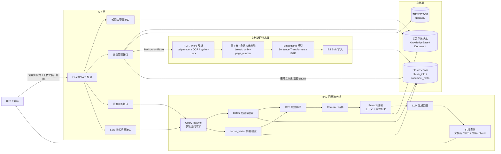
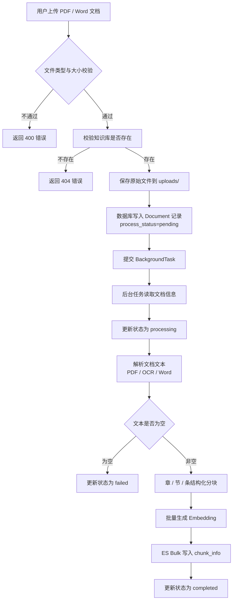
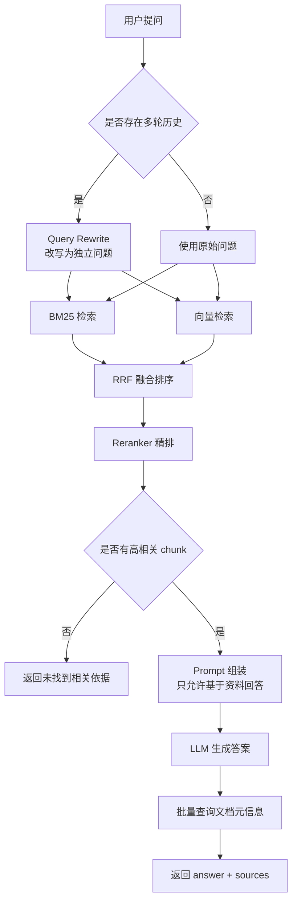

# 政务/企业文档 RAG 问答系统

> 面向政务法规、企业制度、通知公告、知识库文档等场景的 RAG 问答服务。系统支持 PDF / Word 文档上传、后台解析、章/节/条结构化分块、Embedding 向量化、BM25 + 向量混合检索、RRF 融合排序、Reranker 精排、多轮 Query Rewrite、引用溯源、SSE 流式输出，以及 Top-K / MRR / RAGAS 离线评估。

## 1. 项目定位

本项目不是简单的“上传文档后调用大模型回答”的 Demo，而是一个面向真实知识库问答场景的后端服务，重点解决：

- 文档格式复杂：支持 PDF、Word 文档解析，并对扫描件提供 OCR 兜底。
- 文档结构明显：政务法规、企业制度类文档通常具有“章 / 节 / 条”结构，直接定长切块容易破坏语义边界。
- 检索命中不稳定：单一向量检索对条款编号、专有名词、精确术语不够稳定；单一 BM25 对语义改写、口语化问法不够稳定。
- 回答缺少依据：企业知识库场景要求答案可追溯，需要返回文档名、章节、页码和原始 chunk。
- 多轮追问难检索：例如“那例外情况呢？”这类问题需要结合历史上下文改写为独立问题。
- 效果需要量化评估：通过 Top-K、MRR、Faithfulness、Answer Relevancy 等指标对不同检索策略进行对比，而不是凭感觉调参。

## 2. 技术栈

| 模块 | 技术 |
|---|---|
| Web 框架 | FastAPI |
| 数据库 | SQLite / MySQL，SQLAlchemy |
| 搜索引擎 | Elasticsearch |
| 文档解析 | pdfplumber、pytesseract、python-docx |
| Embedding | Sentence-Transformers / BGE |
| Rerank | BGE-Reranker / Cross-Encoder |
| 大模型调用 | OpenAI-compatible SDK，可接入通义千问、DeepSeek、OpenAI 等兼容接口 |
| 流式输出 | Server-Sent Events |
| 离线评估 | RAGAS、datasets、langchain-huggingface |
| 日志 | Python logging，按天滚动文件日志 |

## 3. 核心功能

### 3.1 知识库与文档管理

- 创建知识库，并按知识库隔离文档与检索范围。
- 上传 PDF / Word 文档，支持文件类型和大小校验。
- 文档处理状态跟踪：`pending / processing / completed / failed`。
- 查询单个文档状态、查询知识库下文档列表。
- 删除文档时同步清理 Elasticsearch 中对应 chunk，避免失效内容污染检索结果。

### 3.2 文档解析与结构化分块

- PDF 文本提取，扫描件 OCR 兜底。
- Word 段落和表格解析。
- 通过 `<<PAGE:n>>` 标记保留页码信息。
- 基于“第 X 章 / 第 X 节 / 第 X 条”结构进行语义分块。
- 对过长 chunk 使用滑动窗口二次切分。
- 每个 chunk 保存 `content`、`breadcrumb`、`page_number` 等元数据。

### 3.3 混合检索与重排

- BM25 关键词检索：适合条款编号、专有名词、法规术语、精确关键词。
- dense_vector 向量检索：适合语义相似问法、口语化表达、同义改写。
- RRF 融合排序：融合 BM25 与向量检索结果。
- Reranker 精排：对候选 chunk 进行 query-chunk 相关性重排。
- confidence threshold：过滤低相关性 chunk，减少无依据回答。

### 3.4 Query Rewrite、引用溯源与流式输出

- 对多轮对话中的省略、指代问题进行 Query Rewrite。
- Query Rewrite 失败时降级使用原始 query，不阻塞主流程。
- 回答时返回 `document_id`、`document_name`、`page_number`、`breadcrumb`、`chunk_content`。
- 支持 `/chat/stream` SSE 流式问答接口，回答结束后推送 sources。

### 3.5 离线评估

项目提供三类评估能力：

- `evaluate_retrieval_only.py`：只评估检索，不调用 LLM，不跑 RAGAS，用于快速测试 Top-K / MRR。
- `evaluate_with_topk.py`：端到端评估，统计 Top-K / MRR / 平均耗时 / Faithfulness / Answer Relevancy。
- `build_eval_dataset_with_source.py`：从 ES chunk 生成带来源信息的评估集，支持 chunk 级命中评估。

## 4. 系统总体架构



## 5. 文档处理流程



## 6. RAG 问答流程



## 7. Elasticsearch 索引设计

### 7.1 `document_meta`

用于保存文档元信息，便于根据来源追溯文档。核心字段包括：

- `document_id`
- `knowledge_id`
- `file_name`
- `file_type`
- `created_at`

### 7.2 `chunk_info`

用于保存文档分块和向量信息。核心字段包括：

- `document_id`
- `knowledge_id`
- `chunk_id`
- `page_number`
- `breadcrumb`
- `chunk_content`
- `embedding_vector`

其中：`chunk_content` 用于 BM25 检索，`embedding_vector` 用于 dense_vector 向量检索，`breadcrumb` 和 `page_number` 用于引用溯源。

## 8. 评估设计

本项目使用《中华人民共和国知识产权海关保护条例》构造多类型 QA 评估集，覆盖以下问题类型：

| 类型 | 说明 |
|---|---|
| `exact_clause` | 精确条文题，测试 BM25 基础能力 |
| `semantic_rewrite` | 语义改写题，测试向量检索和 Reranker |
| `scenario` | 场景判断题，模拟真实用户问法 |
| `process` | 流程题，测试跨步骤检索 |
| `multi_clause` | 多条款 / 多条件题，测试跨 chunk 检索 |
| `no_answer` | 无答案题，测试拒答能力 |

## 9. 检索评估结果

### 9.1 Retrieval-only 评估：27 条可回答问题

该评估只测试检索，不调用 LLM，不跑 RAGAS，用于快速观察 BM25、Hybrid + RRF、Hybrid + RRF + Reranker 的 Top-K / MRR 表现。

| 策略 | Top-1 | Top-3 | Top-5 | MRR | 平均检索耗时 |
|---|---:|---:|---:|---:|---:|
| BM25 | 81.48% | 92.59% | 96.30% | 0.8778 | 48.56 ms |
| Hybrid + RRF | 81.48% | 92.59% | 92.59% | 0.8704 | 298.11 ms |
| Hybrid + RRF + Reranker | 88.89% | 100.00% | 100.00% | 0.9383 | 2250.02 ms |

在 27 条可回答问题中，Hybrid + RRF + Reranker 将整体 Top-1 命中率由 81.48% 提升至 88.89%，Top-3 命中率提升至 100%。

### 9.2 Strict Chunk 评估：16 条 chunk 级标注样本

为避免仅按文档级命中导致指标虚高，项目额外构建 strict chunk 子集，只保留带 `expected_chunk_ids` 的 16 条样本，用于评估检索结果是否命中正确 chunk。

| 策略 | Top-1 | Top-3 | Top-5 | MRR | 平均检索耗时 |
|---|---:|---:|---:|---:|---:|
| BM25 | 68.75% | 87.50% | 93.75% | 0.7937 | 51.47 ms |
| Hybrid + RRF | 68.75% | 87.50% | 87.50% | 0.7812 | 424.85 ms |
| Hybrid + RRF + Reranker | 81.25% | 100.00% | 100.00% | 0.8958 | 2303.91 ms |

在 strict chunk 子集中，Hybrid + RRF + Reranker 将 Top-1 命中率由 68.75% 提升至 81.25%，Top-3 命中率提升至 100%，MRR 由 0.7937 提升至 0.8958。

其中，语义改写类问题表现更明显：Hybrid + RRF + Reranker 将语义改写类问题的 Top-1 命中率由 50.00% 提升至 100.00%。

### 9.3 端到端生成质量评估：30 条多类型问题

该评估会调用 LLM 生成答案，并使用 RAGAS 计算 Faithfulness 和 Answer Relevancy。

| 策略 | Top-1 | Top-3 | Top-5 | MRR | 平均检索耗时 | Faithfulness | Answer Relevancy |
|---|---:|---:|---:|---:|---:|---:|---:|
| BM25 | 90.00% | 90.00% | 90.00% | 0.9000 | 47.75 ms | 0.7856 | 0.7108 |
| Hybrid + RRF | 90.00% | 90.00% | 90.00% | 0.9000 | 141.08 ms | 0.8193 | 0.7448 |
| Hybrid + RRF + Reranker | 90.00% | 90.00% | 90.00% | 0.9000 | 2362.72 ms | 0.8628 | 0.7024 |

端到端评估中，Hybrid + RRF + Reranker 的 Faithfulness 最高，从 0.7856 提升至 0.8628，说明重排后的上下文更有助于减少无依据回答。

Hybrid + RRF 的 Answer Relevancy 最高，说明在相关性和忠实度之间仍需根据业务目标做权衡。

## 10. 评估结论

1. 在法规类文档中，BM25 对条款编号、专有名词和精确术语具有较强优势。
2. 单独使用 Hybrid + RRF 并不必然优于 BM25，在本测试集中其 MRR 略低于 BM25。
3. Hybrid + RRF + Reranker 对语义改写类问题和 strict chunk 命中有明显改善。
4. Reranker 可以提升排序质量和 Faithfulness，但会显著增加检索延迟。
5. 生产环境中不应无条件启用 Reranker，应根据问题类型、延迟预算和准确率要求动态选择策略。
6. 流程类、多条款类问题仍是短板，后续可通过 Query Decomposition、父子 chunk、相邻条款上下文扩展等方式优化。

## 11. 运行方式

### 11.1 安装依赖

```bash
pip install -r requirements.txt
```

### 11.2 配置环境变量

```bash
cp .env.example .env
```

填写你的模型服务 API Key：

```env
DASHSCOPE_API_KEY=your_api_key_here
LLM_API_KEY=your_api_key_here
```

### 11.3 配置项目参数

```bash
cp config.yaml.example config.yaml
```

根据本地环境修改 Elasticsearch、数据库、本地模型路径、LLM base_url 和 model。

### 11.4 启动服务

```bash
uvicorn app.main:app --host 0.0.0.0 --port 6006
```

访问接口文档：

```text
http://localhost:6006/docs
```

## 12. 评估脚本使用方式

### 12.1 生成带来源信息的评估集

```bash
python scripts/build_eval_dataset_with_source.py \
  --knowledge_id 1 \
  --num_questions 30 \
  --output scripts/eval_dataset.json
```

生成后需要人工检查 `question`、`ground_truth` 与 `source_content` 是否一致。

### 12.2 只评估检索，不调用 LLM

```bash
python scripts/evaluate_retrieval_only.py \
  --knowledge_id 1 \
  --dataset scripts/eval_dataset_ip_customs_answerable_27.json \
  --output scripts/eval_retrieval_result_27.json
```

### 12.3 端到端评估

```bash
python scripts/evaluate_with_topk.py \
  --knowledge_id 1 \
  --dataset scripts/eval_dataset_ip_customs_balanced_30.json \
  --output scripts/eval_result_topk_30.json
```

### 12.4 生成 strict chunk 子集

```bash
python -c "import json; data=json.load(open('scripts/eval_dataset_ip_customs_answerable_27.json',encoding='utf-8')); strict=[x for x in data if x.get('expected_chunk_ids')]; json.dump(strict,open('scripts/eval_dataset_ip_customs_strict_chunk.json','w',encoding='utf-8'),ensure_ascii=False,indent=2); print(len(strict))"
```

## 13. 项目亮点

- 实现文档上传、后台解析、状态跟踪、删除同步清理 ES 的完整文档生命周期。
- 针对政务/企业制度类文档设计章、节、条结构化分块策略。
- 实现 BM25 + dense_vector 双路召回、RRF 融合和 Reranker 精排。
- 支持 Query Rewrite，提升多轮追问场景下的检索稳定性。
- 支持引用溯源，返回文档名、页码、章节路径和原始 chunk。
- 支持 SSE 流式输出，提升前端问答体验。
- 构建多类型评估集，并对 Top-K、MRR、Faithfulness、Answer Relevancy 和检索耗时进行对比评估。
- 能够基于评估结果分析不同策略的收益与延迟成本，而不是单纯堆叠技术组件。

## 14. 后续优化方向

- 引入 Celery / RQ + Redis，将文档解析、OCR、Embedding、ES 写入改造为可重试任务队列。
- 增加 query_log / feedback_log，记录用户问题、改写后 query、命中 chunk、回答内容、耗时和用户反馈。
- 对流程类、多条款类问题引入 Query Decomposition。
- 引入父子 chunk 或相邻条款上下文扩展，提升跨条款问题召回。
- 对 Reranker 做候选数控制、批量推理、缓存和量化，降低延迟。
- 增加用户权限体系，实现知识库级别的数据隔离。
- 增加 Docker Compose，简化 Elasticsearch、MySQL、FastAPI 的本地启动流程。
- 增加自动化测试，覆盖文档上传、解析、检索、问答和删除流程。

## 15. 面试可讲点

- 为什么法规类文档中 BM25 很强？
- 为什么 Hybrid + RRF 单独不一定优于 BM25？
- Reranker 为什么能提升 strict chunk 命中率？
- 为什么 Faithfulness 提升但 Answer Relevancy 不一定最高？
- Reranker 延迟较高，生产环境如何取舍？
- 流程类问题为什么仍是短板，如何优化？
- 为什么不能只看 RAGAS，还要看 Top-K / MRR？
- 如何设计多类型评估集，避免只偏向 BM25？
