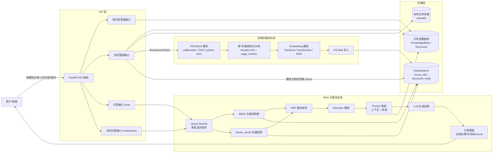
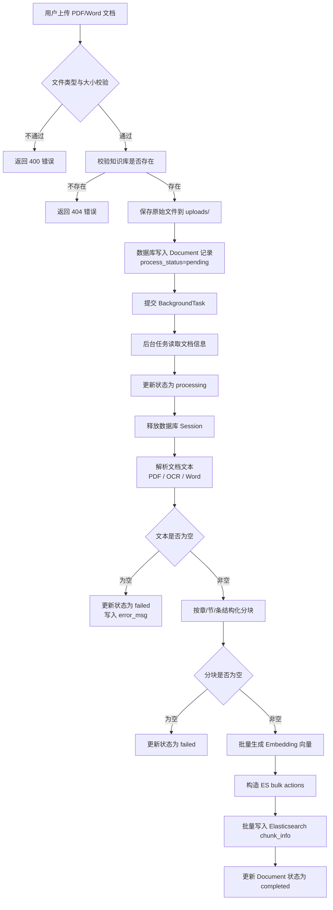
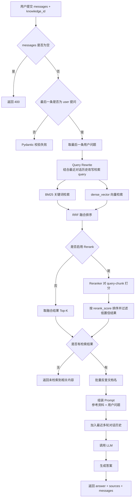

# 政务/企业文档 RAG 问答系统

> 面向政务、企业制度、通知公告、知识库文档等场景的 RAG 问答服务。系统支持 PDF/Word 文档上传、后台解析、章/节/条结构化分块、Embedding 向量化、BM25 + 向量混合检索、RRF 融合排序、Reranker 精排、多轮 Query Rewrite、引用溯源、SSE 流式输出和 RAGAS 离线评估。

## 1. 项目定位

本项目不是简单的“上传文档后调用大模型回答”的 Demo，而是一个完整的文档问答后端服务，重点解决企业知识库场景中的几个问题：

- 文档格式复杂：PDF、Word、扫描件、表格、页眉页脚等内容需要统一解析。
- 文档结构明显：政务/企业制度类文档通常具有“章 / 节 / 条”结构，直接定长切块容易破坏语义边界。
- 检索命中不稳定：单一向量检索对专有名词、编号、精确条款不够稳定。
- 回答缺少依据：用户需要知道答案来自哪个文档、哪个章节、哪一页。
- 多轮追问难检索：例如“那例外情况呢？”这类问题需要结合历史上下文改写后再检索。
- 效果需要评估：需要对不同检索策略进行对比，而不是凭感觉调参。

## 2. 技术栈

| 模块 | 技术 |
| --- | --- |
| Web 框架 | FastAPI |
| 数据库 | SQLite / MySQL，SQLAlchemy |
| 搜索引擎 | Elasticsearch |
| 文档解析 | pdfplumber、pytesseract、python-docx |
| Embedding | Sentence-Transformers / BGE |
| Rerank | Transformers Cross-Encoder / BGE-Reranker |
| 大模型调用 | OpenAI-compatible SDK，可接入通义千问、DeepSeek、OpenAI 等兼容接口 |
| 评估 | RAGAS、datasets、langchain-huggingface |
| 日志 | Python logging，按天滚动文件日志 |

## 3. 核心功能

### 3.1 知识库管理

- 创建知识库。
- 按知识库隔离文档与检索范围。
- 支持知识库级别的问答检索。

### 3.2 文档管理

- 上传 PDF / Word 文档。
- 文件类型校验。
- 文件大小限制，默认最大 50MB。
- 文档处理状态跟踪：`pending / processing / completed / failed`。
- 查询单个文档处理状态。
- 查询某知识库下所有文档。
- 删除文档时同步清理 Elasticsearch 中对应 chunk，避免失效内容污染检索结果。

### 3.3 文档解析与分块

- PDF 文本提取。
- 扫描件 OCR 兜底。
- Word 段落和表格解析。
- 通过 `<<PAGE:n>>` 标记保留页码信息。
- 基于“第 X 章 / 第 X 节 / 第 X 条”结构进行语义分块。
- 对过长 chunk 使用滑动窗口二次切分。
- 每个 chunk 保存：`content`、`breadcrumb`、`page_number`。

### 3.4 混合检索

- BM25 关键词检索：适合精确词、编号、专有名词、条款名。
- dense_vector 向量检索：适合语义相似问法。
- RRF 融合排序：融合 BM25 与向量检索结果。
- Reranker 精排：对候选 chunk 进行 query-chunk 相关性重排。
- confidence threshold：过滤低相关性文档块。

### 3.5 多轮问答与 Query Rewrite

- 对多轮对话中的省略、指代问题进行改写。
- 例如将“那例外情况呢？”结合历史改写为完整独立问题。
- 改写失败时降级使用原始 query，不阻塞主流程。
- LLM 回答时保留最近多轮对话上下文。

### 3.6 引用溯源

系统在生成回答时返回 `sources`，包含：

- document_id
- document_name
- page_number
- chunk_content

用户可以根据来源核验答案依据，降低幻觉风险。

### 3.7 流式输出

- 支持 `/chat/stream` SSE 流式问答接口。
- 大模型每生成一段内容，立即推送给前端。
- 回答结束后推送 sources。

### 3.8 离线评估

- 支持从知识库 chunk 中辅助生成 QA 评估集。
- 支持对 BM25、Hybrid + RRF、Hybrid + RRF + Rerank 进行对比。
- 使用 RAGAS 计算 Faithfulness 和 Answer Relevancy。
- 输出 JSON 评估结果，便于持续优化。

## 4. 系统总体架构



## 5. 文档处理流程



## 6. RAG 问答流程



## 7. 数据模型

### 7.1 KnowledgeBase

| 字段 | 说明 |
| --- | --- |
| knowledge_id | 知识库 ID，主键 |
| title | 知识库名称 |
| category | 知识库类型，如法规、政策、通知 |
| create_dt | 创建时间 |
| update_dt | 更新时间 |

### 7.2 Document

| 字段 | 说明 |
| --- | --- |
| document_id | 文档 ID，主键 |
| knowledge_id | 所属知识库 ID |
| title | 文档标题 |
| category | 文档分类 |
| file_path | 原始文件存储路径 |
| file_type | 文件 MIME 类型 |
| process_status | 文档处理状态：pending / processing / completed / failed |
| error_msg | 解析失败原因 |
| create_dt | 创建时间 |
| update_dt | 更新时间 |

## 8. Elasticsearch 索引设计

### 8.1 document_meta

用于保存文档级别元信息。

| 字段 | 说明 |
| --- | --- |
| document_id | 文档 ID |
| knowledge_id | 知识库 ID |
| document_name | 文档名称 |
| file_path | 文件路径 |
| abstract | 文档摘要 |

### 8.2 chunk_info

用于保存可检索的文档块。

| 字段 | 说明 |
| --- | --- |
| document_id | 文档 ID |
| knowledge_id | 知识库 ID |
| page_number | chunk 起始页码 |
| chunk_id | 文档内 chunk 序号 |
| breadcrumb | 章节路径，如“第一章 总则 > 第三条” |
| chunk_content | chunk 原文内容，支持 BM25 检索 |
| embedding_vector | chunk 向量，支持 dense_vector kNN 检索 |

## 9. API 接口

### 9.1 健康检查

```http
GET /health
```

### 9.2 创建知识库

```http
POST /v1/knowledge_base
Content-Type: application/json
```

请求示例：

```json
{
  "title": "企业制度知识库",
  "category": "制度"
}
```

### 9.3 上传文档

```http
POST /v1/document
Content-Type: multipart/form-data
```

表单字段：

| 字段 | 说明 |
| --- | --- |
| knowledge_id | 所属知识库 ID |
| title | 文档标题 |
| category | 文档分类，默认 default |
| file | PDF / Word 文件 |

### 9.4 查询文档状态

```http
GET /v1/document/{document_id}
```

### 9.5 查询知识库下文档列表

```http
GET /v1/knowledge_base/{knowledge_id}/documents
```

### 9.6 删除文档

```http
DELETE /v1/document/{document_id}
```

删除文档时会同步删除 Elasticsearch 中该文档对应的所有 chunk。

### 9.7 普通问答

```http
POST /chat
Content-Type: application/json
```

请求示例：

```json
{
  "knowledge_id": 1,
  "messages": [
    {
      "role": "user",
      "content": "试用期员工是否享有年假？"
    }
  ]
}
```

响应示例：

```json
{
  "request_id": "uuid",
  "response_code": 200,
  "response_msg": "回答生成成功",
  "processing_time": 1.23,
  "answer": "根据参考资料……",
  "sources": [
    {
      "document_id": 1,
      "document_name": "员工手册",
      "page_number": 3,
      "chunk_content": "原文片段……"
    }
  ],
  "messages": []
}
```

### 9.8 流式问答

```http
POST /chat/stream
Content-Type: application/json
```

返回 `text/event-stream`，格式示例：

```text
data: {"chunk": "根据"}

data: {"chunk": "参考资料"}

data: {"sources": [...]}

data: [DONE]
```

## 10. 快速启动

> 以下为当前代码结构下的通用启动方式。实际路径和依赖版本请以你的 `requirements.txt`、`config.yaml` 和本地模型路径为准。

### 10.1 安装依赖

```bash
pip install -r requirements.txt
```

### 10.2 配置环境变量

```bash
# 通义千问 / 兼容 OpenAI SDK 的模型服务
export DASHSCOPE_API_KEY="your-api-key"
# 或者
export LLM_API_KEY="your-api-key"
```

Windows PowerShell：

```powershell
$env:DASHSCOPE_API_KEY="your-api-key"
```

### 10.3 启动 Elasticsearch

确保 Elasticsearch 已启动，并且 `config.yaml` 中 ES 配置正确。

### 10.4 检查模型路径

在 `config.yaml` 中配置：

- Embedding 模型本地路径。
- Rerank 模型本地路径。
- LLM base_url、model、temperature、top_p、max_tokens。

### 10.5 启动服务

```bash
uvicorn app.main:app --host 0.0.0.0 --port 8000 --reload
```

如果直接运行入口文件：

```bash
python -m app.main
```

### 10.6 查看接口文档

启动后访问：

```text
http://localhost:8000/docs
```

## 11. 评估方式

### 11.1 生成评估集

```bash
python scripts/build_eval_dataset.py \
  --knowledge_id 1 \
  --num_questions 50 \
  --output scripts/eval_dataset.json
```

生成后需要人工检查每条 QA，确认问题和标准答案确实来自文档内容。

### 11.2 执行评估

```bash
python scripts/evaluate.py \
  --knowledge_id 1 \
  --dataset scripts/eval_dataset.json \
  --output scripts/eval_result.json
```

当前评估脚本支持三组实验：

| 实验 | 策略 |
| --- | --- |
| 实验 1 | BM25 |
| 实验 2 | Hybrid + RRF |
| 实验 3 | Hybrid + RRF + Rerank |

当前已接入的指标：

- Faithfulness
- Answer Relevancy

建议后续补充：

- Top-1 Hit Rate
- Top-3 Hit Rate
- Top-5 Hit Rate
- MRR
- 引用准确率
- 拒答准确率
- 平均检索耗时
- 平均生成耗时

## 12. 项目亮点

1. **完整 RAG 链路**：覆盖文档上传、解析、分块、向量化、索引、检索、生成、溯源和评估。
2. **结构化语义分块**：针对政务/企业制度文档，按“章 / 节 / 条”识别结构，减少定长切块造成的上下文割裂。
3. **混合检索**：结合 BM25 和向量检索，兼顾关键词精确匹配与语义相似召回。
4. **RRF 融合排序**：对多路检索结果进行统一融合，降低单一检索策略的不稳定性。
5. **Reranker 精排**：对候选 chunk 做二次相关性打分，提高最终上下文质量。
6. **Query Rewrite**：处理多轮对话中的省略和指代问题，提高连续问答的检索稳定性。
7. **引用溯源**：返回文档名、章节、页码和原文片段，便于用户核验答案。
8. **流式输出**：通过 SSE 支持打字机效果，改善前端交互体验。
9. **评估闭环**：通过评估脚本对不同检索策略进行对比，而不是只凭主观感觉调参。
10. **数据一致性处理**：删除文档时同步清理 ES chunk，避免过期内容污染后续检索。

## 13. 当前边界与后续优化

当前版本更适合学习、面试展示和中小规模知识库验证。若要进一步生产化，可继续优化：

- 使用 Celery / RQ + Redis 替代 FastAPI BackgroundTasks，增强长任务可靠性。
- 增加 query_log 和 feedback_log，用于线上问题追踪和反馈闭环。
- 增加用户、角色和知识库权限控制。
- 补充 Top-K 命中率、MRR、拒答准确率等检索指标。
- 增加 Docker Compose，一键启动 FastAPI、Elasticsearch、MySQL 等依赖。
- 支持增量更新、批量重建索引、索引版本管理。
- 增加接口压测和缓存策略。
- 对表格、图片、扫描件 OCR 质量做更细粒度处理。

