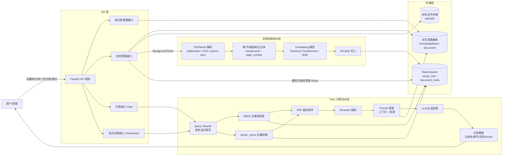
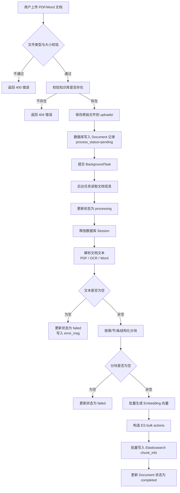
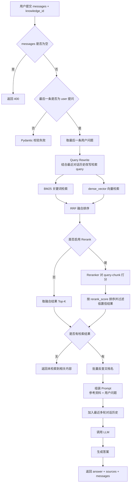
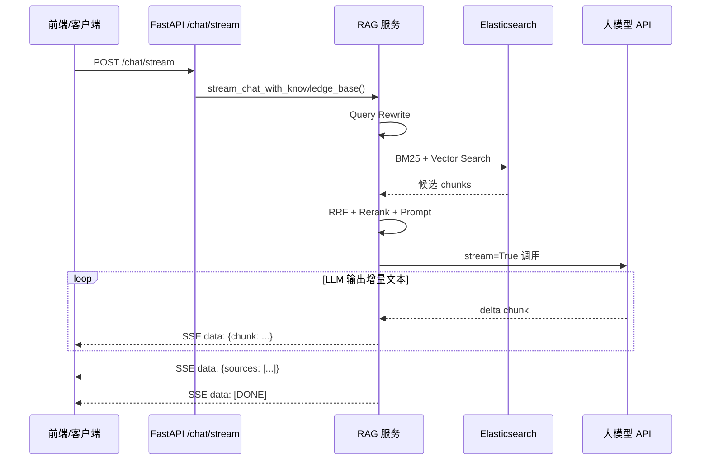
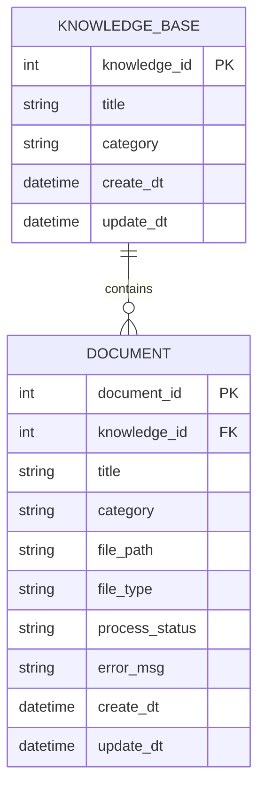
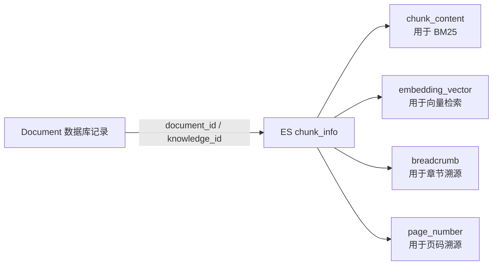
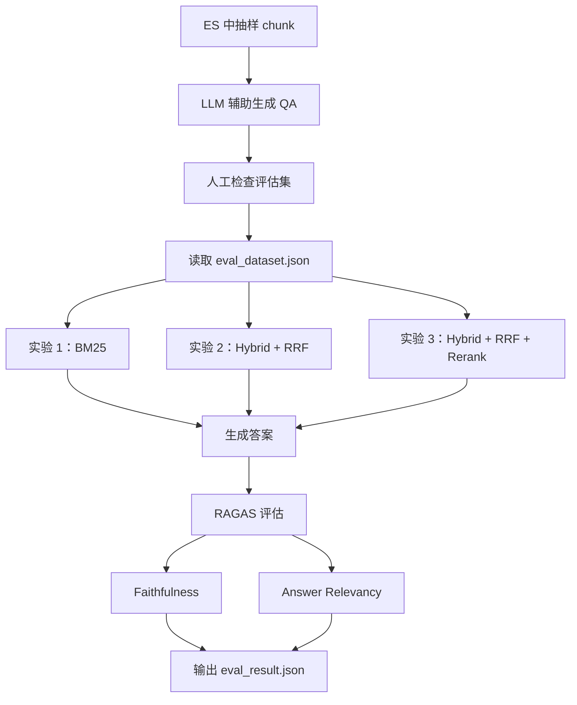

# 政务/企业文档 RAG 问答系统：架构图与流程图

> 以下图表均使用 Mermaid 语法，可直接复制到 GitHub README、飞书文档、Notion 或支持 Mermaid 的 Markdown 编辑器中渲染。

## 1. 系统总体架构图



## 2. 文档上传与索引构建流程图



## 3. RAG 问答流程图



## 4. 混合检索与重排流程图

```mermaid
flowchart LR
    Q[用户问题 / 改写后问题] --> B1[BM25 检索\nmatch chunk_content]
    Q --> V1[Embedding 编码]
    V1 --> V2[ES kNN 检索\ndense_vector cosine]

    B1 --> RRF[RRF 融合\nscore += 1/(k+rank+1)]
    V2 --> RRF

    RRF --> CAND[候选 chunk 列表]
    CAND --> PAIRS[构造 query-chunk pairs]
    PAIRS --> RERANK[Reranker 相关性打分]
    RERANK --> FILTER[阈值过滤 + Top-K 截断]
    FILTER --> CTX[最终上下文]
```

## 5. 流式问答流程图



## 6. 数据模型与索引关系图





## 7. 评估流程图


